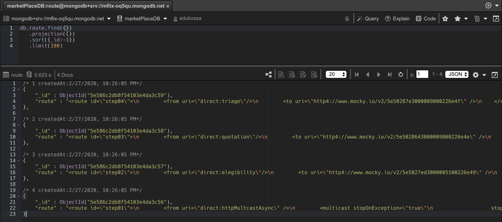

Camel Dynamic Route
=============


Architecture
--

This application consists to load dynamic routes, based at the input on MongoDB.

To make it possible, the following setting were made. 

> We set up a service that load the configurations on MongoDB and transform that in dynamic routes compatible with Apache Camel.  



```java
@Slf4j
@Service
@AllArgsConstructor
public class RouteConfigurationService {

    private RouteConfigurationRepository repository;

    public InputStream routes() {
        final List<Route> routes = this.repository.findAll();

        StringBuilder sb = new StringBuilder();
        sb.append("<routes xmlns=\"http://camel.apache.org/schema/spring\">");
        final List<String> listRoute = routes.stream().map(r -> r.getRoute()).collect(Collectors.toList());
        sb.append(listRoute);
        sb.append("</routes>");

        log.info("Loading routes ...");
        log.info(sb.toString());

        return new ByteArrayInputStream(sb.toString().getBytes(StandardCharsets.UTF_8));
    }

}
```

> CamelContextConfiguration - After that I need to implements this class to receive Callback that allows custom logic during starting up

```java
@Slf4j
@Component
@AllArgsConstructor
public class DynamicRoutesConfiguration implements CamelContextConfiguration {

    private RouteConfigurationService routeConfigurationService;

    @Override
    public void beforeApplicationStart(CamelContext camelContext) {
        log.info("DynamicRoutesConfiguration.beforeApplicationStart");
    }

    @Override
    public void afterApplicationStart(CamelContext camelContext) {
        log.info("DynamicRoutesConfiguration.afterApplicationStart");
        try {
            RoutesDefinition routes = camelContext.loadRoutesDefinition(this.routeConfigurationService.routes());
            camelContext.addRouteDefinitions(routes.getRoutes());
        } catch (Exception e) {
            e.printStackTrace();
        }
    }

}
```

> To test we create a simple API that call my route pre-configured

```java
@Slf4j
@RestController
@RequestMapping("/camel")
public class CamelController {

    @Autowired
    private ProducerTemplate producerTemplate;

    @PostMapping(value = "/route")
    JsonNode route(@RequestBody JsonNode body) {
        JsonNode json = (JsonNode) producerTemplate.requestBody("direct:httpMultcastAsync", body.asText());
        log.info("Response called Http Multicast : " + json.toString());
        return json;
    }

}
```
